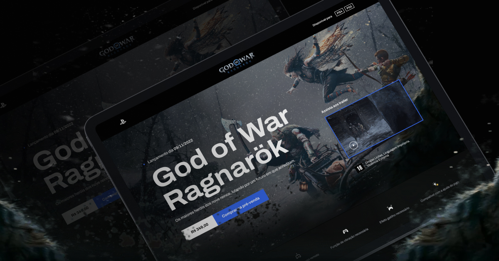

# God of War Ragnarök | Landing Page



This repository contains the project built from scratch as part of a Front-end event Dev Process by [CodeBoost](https://www.youtube.com/@codeboostDev). During the sessions, we dive into creating a God of War Landing Page, step by step, mastering essential web development skills using HTML, SCSS, and JavaScript.

🔥 Layout is avaliable on [Figma Community](https://www.figma.com/file/BPHOdrrzDnuvKPurADmIsW/Codeboost---God-of-War-Ragnarok?node-id=0:1&t=x0igKrsERNUB2qFL-1)


## 🔨 Techs


## ⚙️ Getting Started

-   First, clone this repository:

```bash
git clone https://github.com/olivpeter/godOfWar.git

cd godOfWar
```

-   Install dependencies:

```bash
npm install
```

-   Open with your IDE and run the project:

```bash
code .

npm run dev
```

You can start editing the page by modifying `index.html`. The page auto-updates as you edit the file. You can find style sheets files in `/scss` and its contents in `/scss/partials`.

## 🫡 How to contribute

-   Fork the repository
-   Certify that you have the lastest version of the project

```bash
git pull
```

-   Create a new branch w/ this pattern: `feature/new-feature`

```bash
git checkout -b feature/new-feature
```

-   Commit your changes w/ conventional commit messages
-   Create a Pull Request
-   Wait review and merge to delete your old branch

```bash
git branch -D feature/new-feature
```
